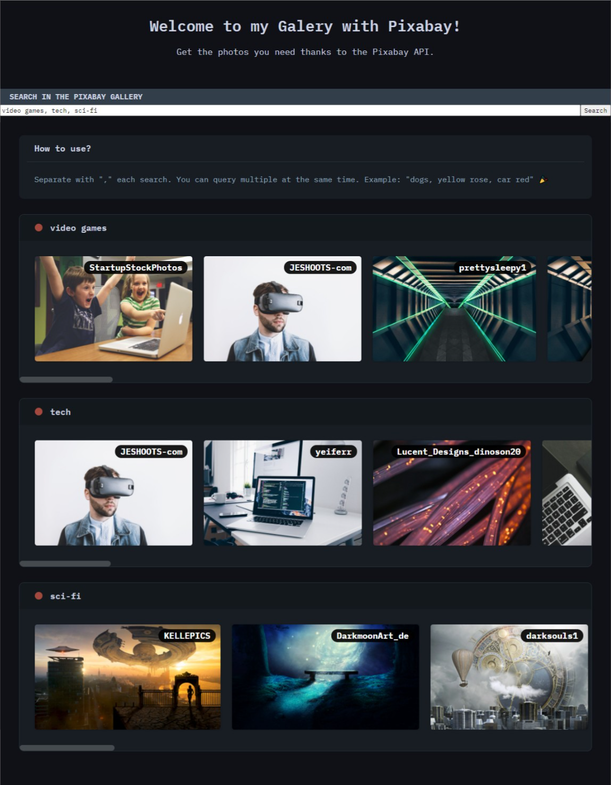

# Galery with Pixabay API
### Get the photos you need thanks to the Pixabay API.

<div align="center">
    
</div>


## Build Setup

``` bash
# install dependencies
npm install

# serve with hot reload at localhost:3000
npm start

# build for production with minification
npm run build
```